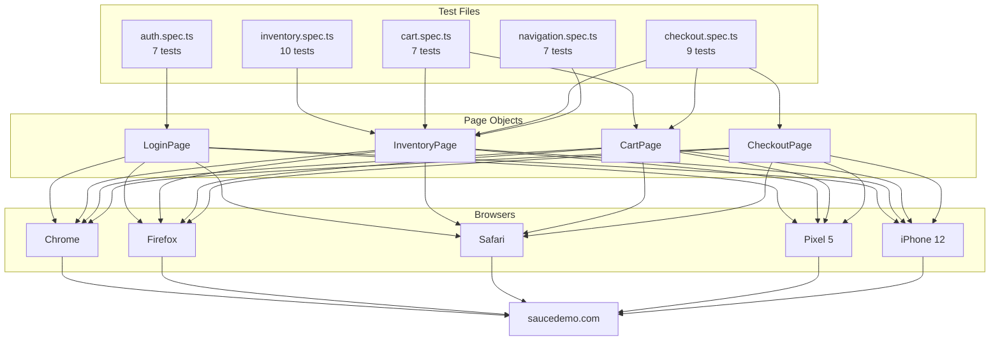

# Playwright E2E Test Suite — Sauce Demo

[](https://playwright.dev)
[](https://www.typescriptlang.org)
[]()
[]()
[]()

---

**Tech stack:** Playwright · TypeScript · Page Object Model · GitHub Actions

**Target:** [https://www.saucedemo.com](https://www.saucedemo.com) — demo e-commerce app สร้างโดย Sauce Labs สำหรับฝึก automation โดยเฉพาะ

---

## วิเคราะห์ site ก่อนเขียน test 

ก่อนเปิด IDE ผม explore site ด้วยมือก่อนแล้ว map structure ออกมา:

**หน้าที่มีทั้งหมด:**
- `/` — Login page
- `/inventory.html` — รายการสินค้า (หลัง login)
- `/inventory-item.html?id=N` — หน้ารายละเอียดสินค้า
- `/cart.html` — ตะกร้าสินค้า
- `/checkout-step-one.html` — กรอกข้อมูลการจัดส่ง
- `/checkout-step-two.html` — สรุปคำสั่งซื้อ
- `/checkout-complete.html` — ยืนยันคำสั่งซื้อ

**สิ่งที่น่าสนใจที่เจอระหว่าง explore:**

1. **User accounts หลายแบบ** ที่ให้ behavior ต่างกัน:
   - `standard_user` — flow ปกติ
   - `locked_out_user` — ถูกบล็อกตั้งแต่ login
   - `problem_user` — รูปภาพพัง, sort ผิด
   - `error_user` — fail ที่ step เฉพาะ
   - `performance_glitch_user` — login ช้า

2. **Sort มี 4 แบบ** (A-Z, Z-A, ราคาต่ำ-สูง, ราคาสูง-ต่ำ) — verify ได้ด้วย code แทนที่จะ hardcode ค่าที่คาดหวัง

3. **Cart badge** อัปเดต real-time — ดีสำหรับ verify state

4. **Sidebar มี Reset App State** — มีประโยชน์สำหรับ teardown scenario

5. **ทุก interactive element มี `data-test` attribute** — นี่คือสัญญาณว่า developer ออกแบบ selector ไว้สำหรับ automation โดยเฉพาะ

---

## วางแผน test strategy

### จัดลำดับความสำคัญด้วย risk-based approach

ผมจัดลำดับ feature ตาม business impact:

```
สูงมาก    Auth (login/logout)         — ถ้า login พัง ทุกอย่างพัง
สูง       Cart (add/remove/persist)   — core user journey
สูง       Checkout (full flow)        — revenue path
กลาง      Inventory (sort/browse)     — discovery & UX
กลาง      Navigation (sidebar/menu)   — usability
```

เขียน test ตามลำดับนี้ ถ้าต้องตัด scope ก็ตัด navigation ออกก่อน

### สิ่งที่เลือกเทส vs สิ่งที่ตัดออกโดยตั้งใจ

**รวมไว้:**
- Happy path ทุก feature
- Negative path หลัก (field ว่าง, password ผิด, account ถูกล็อค)
- State assertion (badge count, button label, URL)
- Data integrity (ราคาต้องตรงกันระหว่างหน้า)

**ตัดออกโดยตั้งใจ:**
- `problem_user` / `performance_glitch_user` — เก็บไว้ Phase 2
- Visual regression — นอก scope ของ suite นี้
- API-level tests — Sauce Demo ไม่มี public API

---

## การตัดสินใจด้าน architecture

### Page Object Model (POM)

แต่ละหน้าของ app map กับ class หนึ่งใน `/pages`:

```
pages/
├── LoginPage.ts
├── InventoryPage.ts
├── CartPage.ts
└── CheckoutPage.ts
```

**ทำไมต้อง POM แทนที่จะเขียน `page.locator()` ตรงๆ ใน test?**

เมื่อ Sauce Labs เปลี่ยน selector ผมแก้แค่ **ที่เดียว** ไม่ต้องไล่แก้ 40 test file สำคัญกว่านั้น POM บังคับให้คิดถึง "contract" ของหน้า ว่าหน้านี้ทำอะไรได้บ้าง แทนที่จะคิดแค่ implementation

แต่ละ page object:
- ประกาศ locator เป็น `readonly` property (type safety, IDE autocomplete)
- เปิด method ที่ระดับ action (`login()`, `addItemToCartByName()`) ไม่ใช่ raw click
- เปิด assertion helper (`expectToBeOnInventoryPage()`) ที่รวม `expect()` หลายบรรทัดไว้เป็นชื่อเดียว

แทนที่ test จะเต็มไปด้วยแบบนี้:

```ts
await page.locator('[data-test="username"]').fill('standard_user');
await page.locator('[data-test="password"]').fill('secret_sauce');
await page.locator('[data-test="login-button"]').click();
await expect(page).toHaveURL('/inventory.html');
await expect(page.locator('.title')).toHaveText('Products');
```

test แค่เรียก:

```ts
await loginPage.loginAsStandardUser();
await inventoryPage.expectToBeOnInventoryPage();
```

### Locator strategy

ใช้ `data-test` attribute เป็นหลัก:

```ts
page.locator('[data-test="login-button"]')
page.locator('[data-test="username"]')
```

**เหตุผล:** `data-test` attribute:
- แยกออกจาก CSS styling — ถ้า class name เปลี่ยน test ไม่พัง
- แยกออกจาก DOM structure — ถ้า element ถูกห่อด้วย div เพิ่ม test ไม่พัง
- Developer เพิ่มไว้สำหรับ automation โดยเฉพาะ — เป็น contract ไม่ใช่ side effect

ที่ไม่มี `data-test` (เช่น burger menu, cart badge) ใช้ ID หรือ class name ที่ semantic และไม่น่าเปลี่ยน

### Test isolation

ทุก test เริ่มจาก clean state ผ่าน `beforeEach`:

```ts
test.beforeEach(async ({ page }) => {
  await loginPage.goto();
  await loginPage.loginAsStandardUser();
});
```

Test ไม่แชร์ browser state กัน แต่ละ test ได้ browser context ของตัวเอง (Playwright default) หมายความว่า:
- รัน parallel ได้ปลอดภัย
- Test ที่ fail ไม่ contaminate test ถัดไป
- ส่วนใหญ่ไม่ต้องมี `afterEach` cleanup

---

## Architecture



---

## Test coverage ละเอียด

### `auth.spec.ts` — 7 tests

| Test | ประเภท | เหตุผล |
|---|---|---|
| Login สำเร็จ | Happy path | Baseline — ทุกอย่างต้องผ่านตรงนี้ก่อน |
| Password ผิด | Negative | ความผิดพลาดที่พบบ่อยที่สุด |
| Locked out user | Edge case | Business scenario: account ถูก suspend |
| Username ว่าง | Boundary | Form validation |
| Password ว่าง | Boundary | Form validation |
| Error message หายหลัง edit | UX behavior | Developer หลายคนลืม test จุดนี้ |
| Page title ถูกต้อง | Smoke | Sanity check เร็วๆ |

### `inventory.spec.ts` — 10 tests

| Test | ประเภท | เหตุผล |
|---|---|---|
| แสดง 6 สินค้า | Smoke | Verify ว่า data โหลด |
| Sort A-Z | Functional | Verify ว่า sort จริง ไม่ใช่แค่เปลี่ยนหน้าตา |
| Sort Z-A | Functional | เหมือนกัน |
| Sort ราคาต่ำ-สูง | Functional | Verify numeric sort |
| Sort ราคาสูง-ต่ำ | Functional | เหมือนกัน |
| กดเข้าหน้า detail | Navigation | Verify routing |
| Add to cart → badge = 1 | State change | Badge คือ feedback หลักของ cart |
| Add 2 ชิ้น → badge = 2 | State accumulation | Badge increment ถูกต้อง |
| Button เปลี่ยนเป็น "Remove" | UI state | Label เป็น feedback ให้ user |
| Remove → badge หาย | State reset | ไม่มี badge เมื่อ cart ว่าง |

Sort test ใช้ programmatic verification — ดึงชื่อ/ราคาทั้งหมด sort ใน JS แล้วเปรียบเทียบกับสิ่งที่หน้าแสดง แทนที่จะ hardcode ค่าที่คาดหวัง วิธีนี้ robust กว่าเพราะถ้า Sauce Labs เพิ่มสินค้าใหม่ test ก็ยังผ่าน

### `cart.spec.ts` — 7 tests

| Test | ประเภท | เหตุผล |
|---|---|---|
| Cart ว่างตอนเข้าครั้งแรก | Baseline | Verify clean state |
| สินค้าที่เพิ่มปรากฏใน cart | Happy path | Core journey |
| หลายสินค้าใน cart | Happy path | Multi-item scenario |
| ลบสินค้าจากหน้า cart | Functional | การลบจาก cart ต่างจากการลบจาก inventory |
| Cart persist หลัง navigate | Persistence | Session state ต้องอยู่รอดข้ามหน้า |
| Badge หายหลังลบสินค้าชิ้นสุดท้าย | State cleanup | ต้องหาย ไม่ใช่แสดง 0 |
| ราคาถูกต้องใน cart | Data integrity | ราคาต้องไม่เปลี่ยนระหว่างหน้า |

Test ราคา (`$29.99` สำหรับ Sauce Labs Backpack) เป็นการ hardcode ตั้งใจ เพราะนี่คือ demo site ที่ราคาไม่เปลี่ยน และ price integrity คือ business concern จริงๆ ที่ควร assert ชัดๆ

### `checkout.spec.ts` — 9 tests

| Test | ประเภท | เหตุผล |
|---|---|---|
| ถึง step 1 จาก cart | Navigation | Validate entry point |
| First name ว่าง → error | Boundary | Test แต่ละ field แยกกัน |
| Last name ว่าง → error | Boundary | เหมือนกัน |
| Postal code ว่าง → error | Boundary | เหมือนกัน |
| ผ่านไป step 2 หลังกรอกครบ | Happy path | Core flow |
| Order total แสดงบน summary | Data presence | Confirm ว่า price summary render |
| Order สำเร็จ → หน้า confirmation | End-to-end | Full revenue path |
| Cart ว่างหลัง order สำเร็จ | Post-order state | Cart ต้องล้างหลังซื้อ |
| Cancel กลับ cart | Escape hatch | User ยกเลิก checkout ได้ |

Test แต่ละ required field แยกกัน — ถ้า test ทุกอย่างพร้อมกัน (`ทั้งหมดว่าง → error`) บอกไม่ได้ว่า validation ตัวไหนทำงาน

### `navigation.spec.ts` — 7 tests

| Test | ประเภท | เหตุผล |
|---|---|---|
| Sidebar เปิดได้ | Smoke | Menu accessible |
| Sidebar ปิดได้ | Functional | Close button ทำงาน |
| Logout ผ่าน sidebar | Auth flow | Session terminate ถูกต้อง |
| All Items link ทำงาน | Navigation | กลับไป inventory ได้ |
| Reset App State | State management | ล้าง cart โดยไม่ logout |
| About link href ถูกต้อง | Link integrity | ชี้ไป saucelabs.com |
| Cart icon → cart page | Navigation | Navigation path หลัก |

Test About link มีเรื่องน่าบอก: ตอนแรกเขียนให้ click link แล้ว verify ว่า navigate ไป `saucelabs.com` ได้จริง แต่ timeout เพราะ external site โหลดช้า

การ assert ที่มีความหมายในที่นี้ไม่ใช่ว่า Sauce Labs' website โหลดได้ — แต่คือ **link ของเราชี้ไป URL ที่ถูก** เลยเปลี่ยนมา assert `href` attribute แทน

นี่คือ mistake ที่พบบ่อยใน test automation: เทสสิ่งที่อยู่นอก boundary ของ system เรา

---

## Multi-browser configuration

```ts
projects: [
  { name: 'chromium',      use: { ...devices['Desktop Chrome'] } },
  { name: 'firefox',       use: { ...devices['Desktop Firefox'] } },
  { name: 'webkit',        use: { ...devices['Desktop Safari'] } },
  { name: 'mobile-chrome', use: { ...devices['Pixel 5'] } },
  { name: 'mobile-safari', use: { ...devices['iPhone 12'] } },
]
```

5 projects × 40 tests = **200 test executions** ต่อ CI run

บน CI (`--workers 1`) รัน sequential เพื่อหลีกเลี่ยง rate limiting, local รัน parallel

---

## CI/CD

GitHub Actions workflow (`.github/workflows/playwright.yml`) trigger บน push และ PR ไป `main`

การตัดสินใจหลัก:
- `retries: 2` บน CI เท่านั้น — network flakiness มีจริงใน CI environment, retry ไม่ได้ซ่อน bug แต่จัดการ infrastructure noise
- `forbidOnly` บน CI — ป้องกัน merge `test.only()` ที่ลืมลบ
- HTML report upload เป็น artifact เก็บ 30 วัน — reviewer ดู failure ได้โดยไม่ต้องรัน test ซ้ำ

---

## วิธีรัน

```bash
# ติดตั้ง dependencies
npm install

# ติดตั้ง browsers
npx playwright install

# รันทุก test (ทุก browser)
npm test

# รัน browser เดียว
npm run test:chromium
npm run test:firefox
npm run test:webkit

# รัน mobile viewport เท่านั้น
npm run test:mobile

# เปิด UI mode แบบ interactive
npm run test:ui

# เปิด HTML report ล่าสุด
npm run report
```

---

## ผลลัพธ์

```
40 tests | 5 files | 40 passed | 0 failed
Browsers: Chromium, Firefox, WebKit, Pixel 5, iPhone 12
Duration: ~12s (Chromium only) | ~45s (all browsers, parallel)
```

---

---

# Playwright E2E Test Suite — Sauce Demo (English)

**Tech stack:** Playwright · TypeScript · Page Object Model · GitHub Actions

**Target:** [https://www.saucedemo.com](https://www.saucedemo.com) — a public demo e-commerce app built by Sauce Labs specifically for automation practice

---

## Background & Approach

### Why Sauce Demo?

Before picking a target site, I evaluated a few options:

| Option | Pros | Cons |
|---|---|---|
| Portfolio site | Real project | Mostly static, few interactions |
| Amazon / real e-commerce | Familiar to everyone | Unstable selectors, bot detection, ToS |
| Sauce Demo | Designed for automation, stable selectors, multiple user types | Familiar to QA community |

Sauce Demo won because it has **realistic e-commerce flows** (login → browse → cart → checkout) while being purpose-built for test automation — no flakiness from A/B tests, captchas, or shifting UI.

---

## Site Analysis (Before Writing a Single Test)

Before opening the IDE, I explored the site manually and mapped out its structure:

**Pages identified:**
- `/` — Login page
- `/inventory.html` — Product listing (post-login)
- `/inventory-item.html?id=N` — Product detail
- `/cart.html` — Shopping cart
- `/checkout-step-one.html` — Shipping info form
- `/checkout-step-two.html` — Order summary
- `/checkout-complete.html` — Confirmation

**Interesting test vectors found during exploration:**

1. **Multiple user accounts** with different behaviors baked in:
   - `standard_user` — normal flow
   - `locked_out_user` — blocked at login
   - `problem_user` — broken images, wrong sort behavior
   - `error_user` — fails at specific steps
   - `performance_glitch_user` — slow login

2. **Sorting** has 4 options (A-Z, Z-A, price low-high, price high-low) — verifiable programmatically instead of hardcoding expected values

3. **Cart badge** updates dynamically — good for state verification

4. **Sidebar has Reset App State** — useful for test teardown scenarios

5. **All interactive elements have `data-test` attributes** — a signal that selectors were designed for automation

---

## Test Strategy

### Risk-based prioritization

I ranked features by business impact:

```
CRITICAL    Auth (login/logout)         — gate to everything else
HIGH        Cart (add/remove/persist)   — core user journey
HIGH        Checkout (full flow)        — revenue path
MEDIUM      Inventory (sort/browse)     — discovery & UX
MEDIUM      Navigation (sidebar/menu)   — usability
```

Tests were written in that priority order. If scope had to be cut, navigation goes first.

### What to test vs. what to skip

**Included:**
- All happy paths for each feature
- Key negative paths (empty fields, wrong credentials, locked account)
- State assertions (badge count, button label changes, URL changes)
- Data integrity (prices must match between pages)

**Deliberately excluded:**
- `problem_user` / `performance_glitch_user` flows — Phase 2 scope
- Visual regression — out of scope for this suite
- API-level tests — Sauce Demo has no public API

---

## Architecture Decisions

### Page Object Model (POM)

Each page in the app maps to one class in `/pages`:

```
pages/
├── LoginPage.ts
├── InventoryPage.ts
├── CartPage.ts
└── CheckoutPage.ts
```

**Why POM instead of raw `page.locator()` in tests?**

When a selector changes, I update it in **one place**, not across 40 test files. More importantly, POM forces thinking about the page's contract — what actions it exposes — rather than implementation details.

Each page object:
- Declares locators as readonly properties (type safety, IDE autocomplete)
- Exposes action methods (`login()`, `addItemToCartByName()`) not raw clicks
- Exposes assertion helpers (`expectToBeOnInventoryPage()`) that bundle multiple `expect()` calls into a named concept

Instead of this scattered across tests:

```ts
await page.locator('[data-test="username"]').fill('standard_user');
await page.locator('[data-test="password"]').fill('secret_sauce');
await page.locator('[data-test="login-button"]').click();
await expect(page).toHaveURL('/inventory.html');
await expect(page.locator('.title')).toHaveText('Products');
```

Tests simply call:

```ts
await loginPage.loginAsStandardUser();
await inventoryPage.expectToBeOnInventoryPage();
```

### Locator strategy

`data-test` attributes as the primary selector strategy:

```ts
page.locator('[data-test="login-button"]')
page.locator('[data-test="username"]')
```

**Reasoning:** `data-test` attributes are:
- Decoupled from CSS styling — won't break if class names change
- Decoupled from DOM structure — won't break if elements are wrapped in extra divs
- Intentionally added by developers for test automation — a contract, not a side effect

Where `data-test` wasn't available (burger menu, cart badge), stable IDs or semantic class names were used.

### Test isolation

Every test starts from a clean state via `beforeEach`:

```ts
test.beforeEach(async ({ page }) => {
  await loginPage.goto();
  await loginPage.loginAsStandardUser();
});
```

Tests don't share browser state. Each test gets its own browser context (Playwright default):
- Tests run in parallel safely
- A failing test doesn't contaminate the next one
- No `afterEach` cleanup needed for most cases

---

## Test Coverage

### `auth.spec.ts` — 7 tests

| Test | Type | Why |
|---|---|---|
| Login with valid credentials | Happy path | Baseline — everything else depends on this |
| Invalid password | Negative | Most common user mistake |
| Locked out user | Edge case | Business scenario: account suspension |
| Empty username | Boundary | Form validation |
| Empty password | Boundary | Form validation |
| Error message clears on edit | UX behavior | Many devs forget to test this |
| Page has correct title | Smoke | Quick sanity check |

### `inventory.spec.ts` — 10 tests

| Test | Type | Why |
|---|---|---|
| 6 products displayed | Smoke | Verify data loads |
| Sort A-Z | Functional | Verify sort is real, not cosmetic |
| Sort Z-A | Functional | Same |
| Sort price low-high | Functional | Verify numeric sort |
| Sort price high-low | Functional | Same |
| Navigate to product detail | Navigation | Verify routing |
| Add to cart → badge shows 1 | State change | Badge is primary cart feedback |
| Add 2 items → badge shows 2 | State accumulation | Badge increments correctly |
| Button changes to "Remove" after adding | UI state | Label is user feedback |
| Remove from inventory → badge hidden | State reset | No badge when cart empty |

Sort tests use programmatic verification — fetch all item names/prices, sort them in JS, compare with what the page shows. If Sauce Labs adds a new product, tests still pass.

### `cart.spec.ts` — 7 tests

| Test | Type | Why |
|---|---|---|
| Empty cart on first visit | Baseline | Verify clean state |
| Added item appears in cart | Happy path | Core journey |
| Multiple items in cart | Happy path | Multi-item scenario |
| Remove item from cart page | Functional | Cart-side removal differs from inventory-side |
| Cart persists after navigation | Persistence | Session state must survive page changes |
| Badge clears after last item removed | State cleanup | Should disappear, not show 0 |
| Item price correct in cart | Data integrity | Price shouldn't change between pages |

The price test (`$29.99` for Sauce Labs Backpack) is an intentional hardcoded assertion — this is a demo site with fixed prices, and price integrity is a real business concern worth asserting explicitly.

### `checkout.spec.ts` — 9 tests

| Test | Type | Why |
|---|---|---|
| Reaches step 1 from cart | Navigation | Entry point validation |
| Missing first name → error | Boundary | All 3 required fields tested individually |
| Missing last name → error | Boundary | Same |
| Missing postal code → error | Boundary | Same |
| Proceeds to step 2 after valid info | Happy path | Core flow |
| Order total visible on summary | Data presence | Confirm price summary renders |
| Completes order → confirmation | End-to-end | Full revenue path |
| Cart clears after order | Post-order state | Cart should be empty after purchase |
| Cancel returns to cart | Escape hatch | User can abort checkout |

Each required field is tested independently — testing them together (`all empty → error`) doesn't tell you which validation fired.

### `navigation.spec.ts` — 7 tests

| Test | Type | Why |
|---|---|---|
| Sidebar opens | Smoke | Menu is accessible |
| Sidebar closes | Functional | Close button works |
| Logout via sidebar | Auth flow | Session terminates correctly |
| All Items link works | Navigation | Returns to inventory |
| Reset App State | State management | Clears cart without logout |
| About link href | Link integrity | Points to saucelabs.com |
| Cart icon → cart page | Navigation | Core navigation path |

The About link test deserves a note: I originally wrote it to click the link and verify navigation to `saucelabs.com`. It timed out because the external site was slow to load.

The meaningful assertion here isn't that Sauce Labs' website loads — it's that **our link points to the right URL**. I rewrote it to assert the `href` attribute instead.

This is a common mistake in test automation: testing things outside your system's boundary.

---

## Multi-browser Configuration

```ts
projects: [
  { name: 'chromium',      use: { ...devices['Desktop Chrome'] } },
  { name: 'firefox',       use: { ...devices['Desktop Firefox'] } },
  { name: 'webkit',        use: { ...devices['Desktop Safari'] } },
  { name: 'mobile-chrome', use: { ...devices['Pixel 5'] } },
  { name: 'mobile-safari', use: { ...devices['iPhone 12'] } },
]
```

5 projects × 40 tests = **200 test executions** per CI run.

On CI (`--workers 1`) tests run sequentially to avoid rate-limiting. Locally they run in parallel.

---

## CI/CD

GitHub Actions workflow (`.github/workflows/playwright.yml`) triggers on push and PR to `main`.

Key decisions:
- `retries: 2` on CI only — network flakiness is real in CI environments; retries handle infrastructure noise without hiding real bugs
- `forbidOnly` on CI — prevents accidentally merging `test.only()` left in code
- HTML report uploaded as artifact with 30-day retention — reviewers can inspect failures without re-running

---

## How to Run

```bash
# Install dependencies
npm install

# Install browsers
npx playwright install

# Run all tests (all browsers)
npm test

# Run single browser
npm run test:chromium
npm run test:firefox
npm run test:webkit

# Run mobile viewports only
npm run test:mobile

# Open interactive UI mode
npm run test:ui

# Open last HTML report
npm run report
```

---

## Results

```
40 tests | 5 files | 40 passed | 0 failed
Browsers: Chromium, Firefox, WebKit, Pixel 5, iPhone 12
Duration: ~12s (Chromium only) | ~45s (all browsers, parallel)
```
